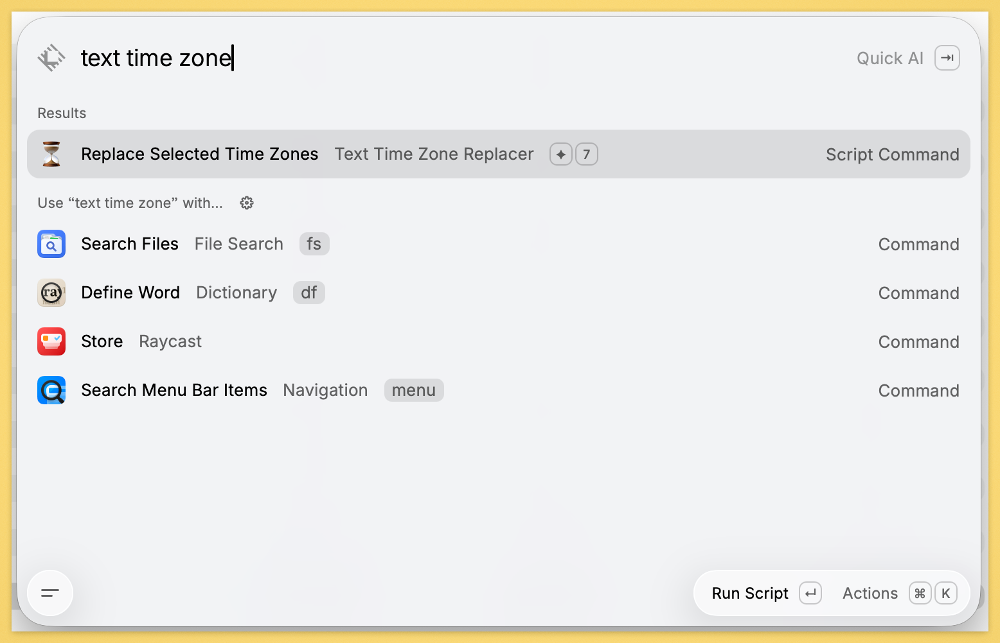
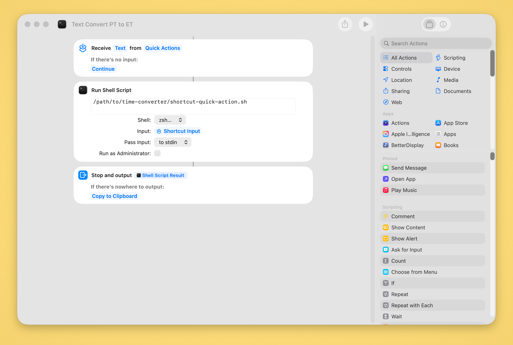
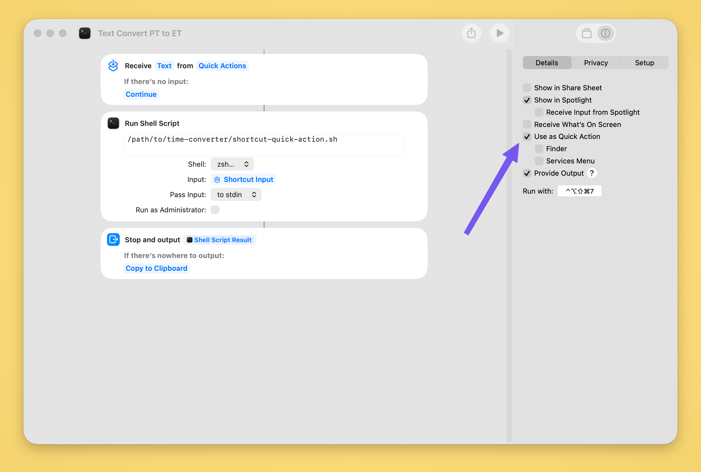
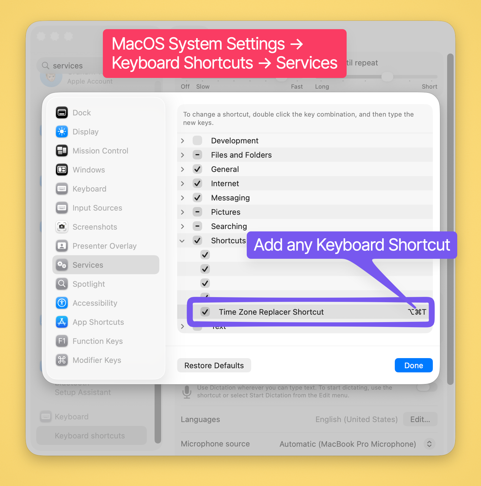
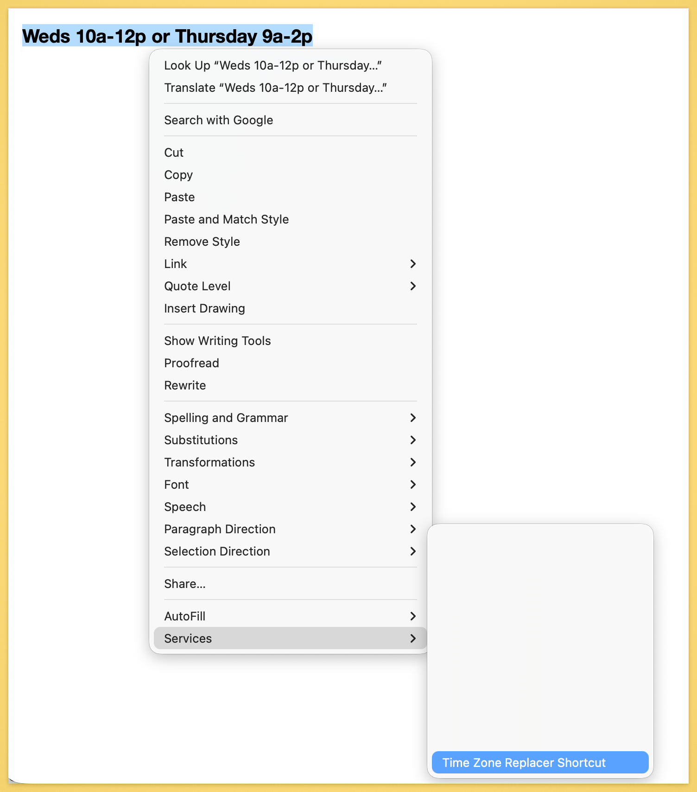

# Text Time Zone Replacer

Text Time Zone Replacer is a small Mac utility for people who often write
appointment or meeting times for people in different US time zones.

It lets you type a time in plain language, select it, press a keyboard shortcut,
and replace it with a clearer time zone version.

Example:

```text
Weds 5pm
```

becomes:

```text
Weds 5pm (PT) / 8pm (ET)
```

It also works with simple ranges:

```text
Weds 4:30pm - 5pm
```

becomes:

```text
Weds 4:30pm - 5pm (PT) / 7:30pm-8pm (ET)
```

## Which Version Should I Use?

There are two ways to install this.

| Option | Best For | What You Need |
| --- | --- | --- |
| **Option A: Raycast Script Command** | Fastest and easiest day-to-day use if you already use Raycast | Raycast and Node.js |
| **Option B: macOS Shortcut** | Built-in Mac option without Raycast | Apple Shortcuts and Node.js |

If you are unsure, use the **Raycast Script Command** version if you already
have Raycast. Otherwise use the **macOS Shortcut** version.

Both options use the same small JavaScript time converter, so **both options
require Node.js**.

## Step 1: Download This Folder

On GitHub, click the green **Code** button, then choose **Download ZIP**.

After the ZIP file downloads:

1. Double-click it to unzip it.
2. Move the unzipped folder somewhere you can find it, such as your Desktop or
   Documents folder.
3. Keep that folder on your Mac. The Raycast or Shortcut command will use files
   inside it.

The folder is the app. If you delete or move it later, you may need to update
your Raycast or Shortcut setup.

## Step 2: Install Node.js

This tool needs Node.js because the time conversion code runs as a small
JavaScript program. This is true for both install options.

Install Node.js from:

https://nodejs.org/

Choose the default installer options.

## Step 3: Prepare the Converter

Open the Terminal app on your Mac.

In Terminal, type `cd ` with a space after it. Then drag the downloaded project
folder from Finder into the Terminal window. Terminal will fill in the folder
path for you.

Press Return.

Then run:

```zsh
npm install
npm run build
```

You only need to do this once, unless you later update the code.

## Step 4: Choose One Install Path

At this point, choose **one** of the two install paths below.

You do not need to set up both.

## Option A: Raycast Script Command

This is the fastest option.

### Install

1. Open Raycast.
2. Open **Raycast Settings**.
3. Go to **Extensions**.
4. Find **Script Commands**.
5. Click **Add Directories**.
6. Choose this folder inside the project:

```text
raycast-scripts
```

Raycast should find a command named:

```text
Replace Selected Time Zones
```



### Add a Keyboard Shortcut

1. In Raycast, search for **Replace Selected Time Zones**.
2. Open the command settings.
3. Assign a keyboard shortcut.

### Use It

1. Type text like `Weds 5pm`.
2. Select that text.
3. Press your Raycast keyboard shortcut.
4. The selected text should be replaced with `Weds 5pm (PT) / 8pm (ET)`.

macOS may ask Raycast for Accessibility or Automation permission. Allow it.
Those permissions are needed so Raycast can copy and replace the selected text.

More details are in [RAYCAST_SCRIPT_COMMAND.md](RAYCAST_SCRIPT_COMMAND.md).

## Option B: macOS Shortcut

Use this if you do not use Raycast.

The Mac Shortcuts app can create a “Quick Action” that appears in the system
Services menu and can be assigned a keyboard shortcut.

### Install

The easiest way is to import the included Shortcut file:

[Time Zone Replacer Shortcut.shortcut](<Time Zone Replacer Shortcut.shortcut>)

1. Double-click `Time Zone Replacer Shortcut.shortcut`.
2. Click **Add Shortcut** or **Set Up Shortcut** when the Shortcuts app opens.
3. When prompted, choose the `shortcut-quick-action.sh` file inside this
   downloaded project folder.
4. In System Settings, assign a keyboard shortcut under
   **Keyboard > Keyboard Shortcuts > Services**.

Full instructions are in [SHORTCUT.md](SHORTCUT.md).







The Shortcut still uses the files in this folder. If you move or delete the
folder later, you may need to set up the Shortcut again.

### Use It

1. Type text like `Weds 5pm`.
2. Select that text.
3. Run the Shortcut using the keyboard shortcut you assigned.
4. The selected text should be replaced with `Weds 5pm (PT) / 8pm (ET)`.



## Changing the Time Zones

Both versions can be customized with the same two settings.

For Raycast, edit this file:

```text
raycast-scripts/replace-selected-time-zones.sh
```

For the macOS Shortcut, edit this file:

```text
shortcut-quick-action.sh
```

Near the top of either file, you will see:

```zsh
SOURCE_ZONE="PT"
OUTPUT_ZONES="PT, ET"
```

`SOURCE_ZONE` means “how should the original text be interpreted?”

`OUTPUT_ZONES` means “which time zones should be shown?”

For example, to show Pacific, Eastern, and Central European Time:

```zsh
OUTPUT_ZONES="PT, ET, CET"
```

That would produce output like:

```text
Weds 5pm (PT) / 8pm (ET) / Thu 2am (CET)
```

Common aliases include `PT`, `ET`, `CT`, `MT`, `UTC`, `GMT`, `CET`, and `JST`.
Advanced users can also use full time zone names like `Europe/London`.

## What Text Works?

This works well with common natural-language time text, including:

```text
Weds 5pm
tomorrow 3pm
next Friday 2pm
Weds 4:30pm - 5pm
Fri 11pm
```

If the date crosses midnight in another time zone, the output includes the day:

```text
Fri 11pm (PT) / Sat 2am (ET)
```

## Troubleshooting

If nothing happens:

1. Make sure you selected text before running the command.
2. Make sure you ran `npm install` and `npm run build`.
3. If using Raycast, run **Refresh Script Commands** in Raycast.
4. If macOS asks for Accessibility or Automation permission, allow it.

If Raycast shows the wrong command:

1. Make sure you added the `raycast-scripts` folder, not the whole repository.
2. Remove any old test Script Command folders from Raycast.
3. Run **Refresh Script Commands**.

## Attribution

Portions of this project are derived from Raycast's MIT-licensed
`time-converter` extension. See [NOTICE.md](NOTICE.md).
